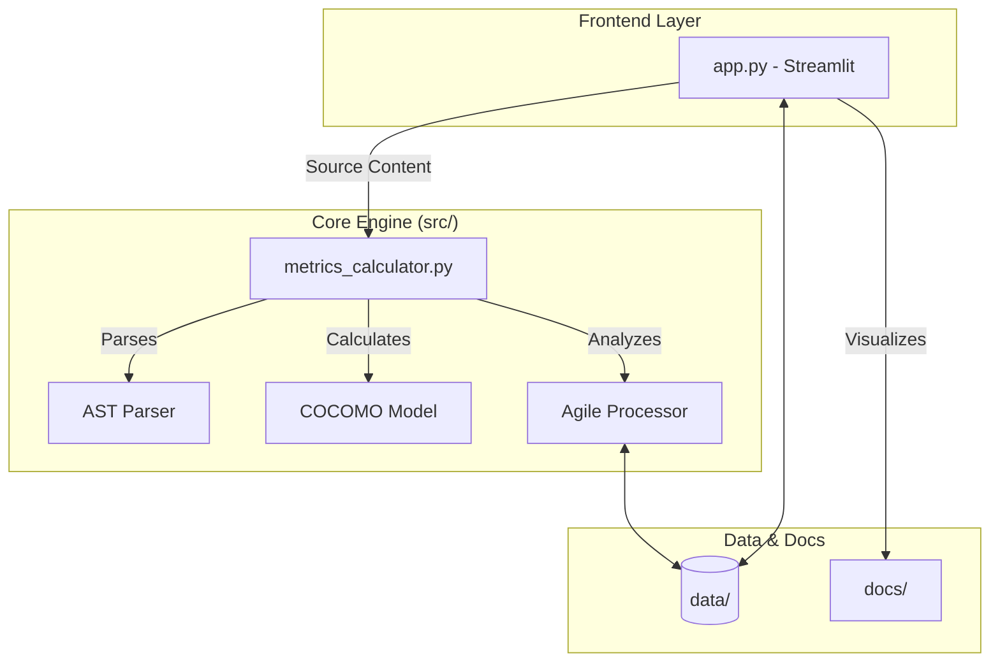
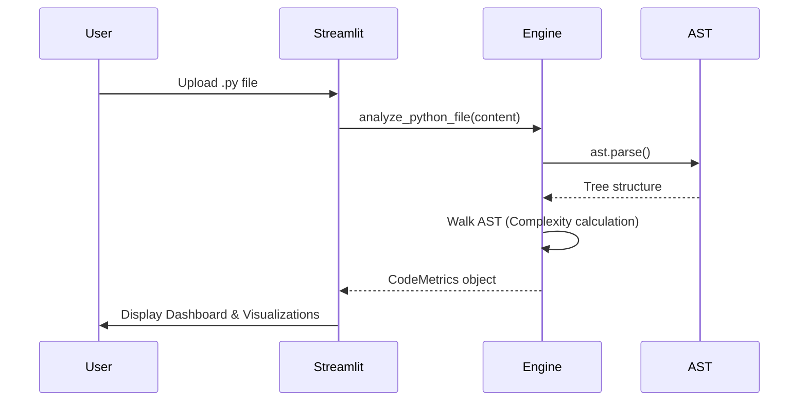

<div align="center">

# 📊 Software Metrics Calculator

[](https://github.com/AhmadHassan-BTed/Software-Metrics-Calculator/actions)
[](https://opensource.org/licenses/MIT)
[](https://www.python.org/)
[](https://streamlit.io/)

**A professional dashboard for automated software quality analysis and project estimation.**

[Report Bug](https://github.com/AhmadHassan-BTed/Software-Metrics-Calculator/issues) · [Request Feature](https://github.com/AhmadHassan-BTed/Software-Metrics-Calculator/issues)

</div>

---

## 📖 Overview

Software Metrics Calculator is an engineering-focused tool designed to provide actionable insights into codebases and project health. It leverages Abstract Syntax Tree (AST) parsing to calculate complexity and standard estimation models like COCOMO to predict development effort.

---

## ✨ Core Features

| Feature | Description |
| :--- | :--- |
| **AST Analysis** | Static code analysis for Cyclomatic and Cognitive complexity. |
| **Agile Tracking** | Automated Velocity and Scope Creep metrics from sprint data. |
| **Project Estimation** | COCOMO-based effort, duration, and staffing predictions. |
| **Refactoring Engine** | Logic-based recommendations for high-complexity modules. |
| **Visual Dashboard** | Interactive Plotly-based visualizations for data distribution. |

---

## 🏗️ Architecture & System Flow

### Internal Module Structure
The system is divided into a clean separation of UI and calculation logic.



### Data Processing Workflow
How the system processes an uploaded Python file:



---

## 📂 Repository Structure

```text
Software-Metrics-Calculator/
├── .github/               # CI/CD Workflows & Issue Templates
├── src/                   # Core Logic
│   ├── __init__.py
│   └── metrics_calculator.py
├── data/                  # Sample JSON/DB Datasets
├── docs/                  # Architecture & Detailed Documentation
├── tests/                 # Test Suite & Sample Data
├── app.py                 # Streamlit Entry Point
├── pyproject.toml         # Project Metadata & Deps
└── requirements.txt       # Dependency List
```

---

## 🚀 Getting Started

### Quick Start
```bash
# Clone the repository
git clone https://github.com/AhmadHassan-BTed/Software-Metrics-Calculator.git

# Install dependencies
pip install -r requirements.txt

# Run the app
streamlit run app.py
```

<details>
<summary><b>🛠️ Advanced Installation (Virtual Env)</b></summary>

1. **Initialize Environment**
   ```bash
   python -m venv venv
   source venv/bin/activate  # Windows: venv\Scripts\activate
   ```

2. **Install with Dev Dependencies**
   ```bash
   pip install -e .
   pip install pre-commit
   pre-commit install
   ```
</details>

---

## ⚙️ Technical Pipeline

The application processes data through three distinct pipelines:

1. **Static Code Pipeline**: Uses the `ast` module to traverse the code structure without execution, identifying decision points and nesting levels.
2. **Estimation Pipeline**: Implements the Basic COCOMO model to translate kLOC (thousand Lines of Code) into personnel requirements.
3. **Agile Pipeline**: Aggregates sprint-level JSON data to track performance trends over time.

---

## 🤝 Development & Contributing

Contributions are welcome! Please follow these steps:

1. **Fork** the repository.
2. **Create** a feature branch (`git checkout -b feature/AmazingFeature`).
3. **Commit** your changes (`git commit -m 'Add AmazingFeature'`).
4. **Push** to the branch (`git push origin feature/AmazingFeature`).
5. **Open** a Pull Request.

Refer to [CONTRIBUTING.md](CONTRIBUTING.md) for more details.

---

## 📄 License

Distributed under the MIT License. See `LICENSE` for more information.

<div align="center">
    <p>Built with ❤️ by Ahmad Hassan (B-Ted)</p>
</div>
