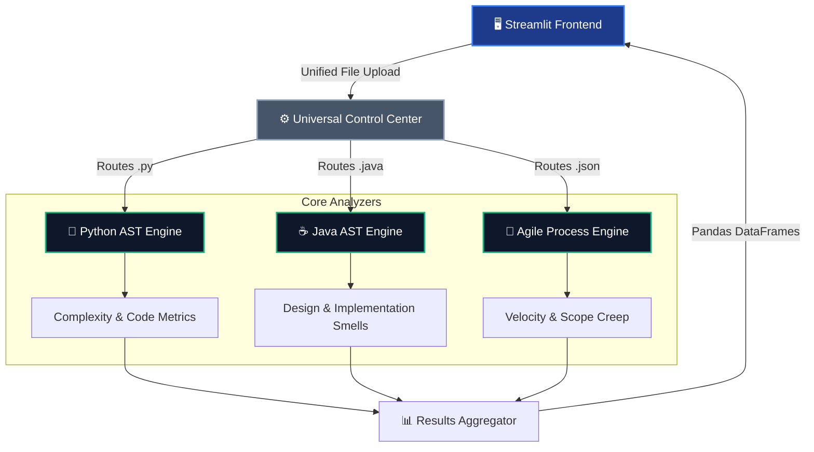

<div align="center">

# 🛡️ CoDiver: Code Sniffer & Project Analyzer

*An advanced, open-source unified platform for code quality, architecture metrics, and Agile analytics.*

[](#)
[](#)
[](#)
[](#)
[](#)

</div>

---

## 📖 The Philosophy

Software is inherently human. Behind every line of code, every architectural decision, and every sprint metric lies human effort and engineering intent. The **CoDiver: Code Sniffer & Project Analyzer** was built on the premise that technical debt shouldn't be an abstract concept—it should be deeply visible, understandable, and actionable.

This platform bridges the gap between raw codebase complexity and human understanding. By unifying Python parsing, Java static analysis, and Agile process tracking into a single frictionless dashboard, the suite abstracts away the borders between languages and focuses purely on **the code**.

---

## 🏗️ Architecture Overview

The platform operates on a **Zero-Coupling, Event-Reactive Architecture**. The frontend strictly delegates analysis to isolated backend engines, which parse raw files into Abstract Syntax Trees (ASTs) on the fly.



---

## ⚙️ Request Lifecycle & Data Flow

Data flows deterministically from the browser, through the AST generators, into Pandas dataframes, and back out to Plotly visuals. The UI remains fully stateless until explicitly commanded to execute an analysis.

```mermaid
sequenceDiagram
    participant User as Developer
    participant UI as 🖥️ UI (app.py)
    participant Engine as ⚙️ Analyzer Engine
    participant State as 💾 Session State
    
    User->>UI: Uploads Source Code (.py, .java)
    UI->>UI: Auto-categorize by extension
    User->>UI: Adjusts Global Parameters
    User->>UI: Executes CoDiver Analysis
    
    UI->>Engine: Dispatches raw UTF-8 strings & configs
    
    rect rgb(30, 41, 59)
        Note right of Engine: Backend Processing Phase
        Engine->>Engine: Generate Abstract Syntax Trees
        Engine->>Engine: Traverse classes, fields, methods
        Engine->>Engine: Evaluate Code Smells & Constraints
    end
    
    Engine-->>State: Yield structured dictionaries
    State->>State: Transform to Pandas DataFrames
    State-->>UI: Triggers reactive re-render
    
    UI-->>User: Displays interactive visualizations
```



---

## 🧩 Internal Module Structure

The repository enforces a strict separation between UI logic and calculation algorithms to guarantee high cohesion and maintainability at scale.

<details>
<summary><b>📂 Click to expand the Project Tree</b></summary>

```text
CoDiver/
├── app.py                      # Master Unified Controller & UI Entry Point
├── requirements.txt            # Dependency configuration
└── src/
    ├── java_analyzer/          # Java Static Analysis Subsystem
    │   ├── analyzer_engine.py  # javalang AST traversal logic
    │   ├── dashboard.py        # Session state & execution handlers
    │   ├── detectors/          # Code Smell logic (Design, Naming, etc.)
    │   └── utils/              # UI components & helpers
    │
    └── software_metrics/       # Python & Agile Analytics Subsystem
        ├── calculators/        # Core calculation algorithms (COCOMO, Agile)
        ├── ui/                 # Visualization components (Charts, Cards)
        └── tests/              # Subsystem validation
```
</details>

---

## ✨ System Capabilities

| Subsystem | Core Responsibilities | Underlying Tech |
| :--- | :--- | :--- |
| **Code Metrics** | AST generation, Cyclomatic & Cognitive complexity mapping, Defect density prediction, COCOMO estimation. | `ast`, `radon` |
| **Static Architecture** | God Class detection, Feature Envy identification, naming conventions, Javadoc validation, raw LOC distributions. | `javalang` |
| **Agile Process** | Velocity tracking, sprint burndown visualization, scope creep calculation. | `pandas`, `plotly` |
| **Universal Control** | Unified drag-and-drop ingestion, cross-language processing dispatch, dynamic parameter routing. | `streamlit` |

---

## 🚀 Build & Deployment Pipeline

Because this application leverages a robust Python backend for intensive AST processing, it is deployed natively via containerized Python runtimes (and cannot be served statically via standard GitHub Pages).

### Live Deployment (Streamlit Cloud)
The most reliable deployment strategy for this architecture is via **Streamlit Community Cloud**:

1. **Commit** the codebase to a public GitHub repository.
2. Navigate to [Streamlit Share](https://share.streamlit.io/).
3. Connect the repository and point the main file path to `app.py`.
4. The cloud environment automatically parses `requirements.txt` and exposes the unified application globally.

### Local Development Workflow
To initialize the suite in a local development environment:

```bash
# 1. Clone the repository
git clone https://github.com/yourusername/CoDiver.git
cd CoDiver

# 2. Install AST parsers and UI dependencies
pip install -r requirements.txt

# 3. Boot the reactive frontend server
streamlit run app.py
```

---

## 🤝 Development & Contribution

New ideas, architectural optimizations, and structural improvements are warmly welcomed. The system is designed to be highly extensible—adding support for a new language parser simply requires introducing a new module within `src/` and wiring it to the Universal Control Center in `app.py`.

*When modifying the codebase, please ensure that UI concerns remain strictly separated from backend AST calculation logic.*

---

## 👨‍💻 Engineering Credits

**Ahmad Hassan (B-Ted)**  
*Software Engineer*

This architecture was designed and engineered from the ground up to solve complex software quality tracking constraints using modern, event-driven Python web paradigms. 

## 📄 License

This repository is published under the [MIT License](LICENSE), promoting open knowledge and collaborative engineering.
