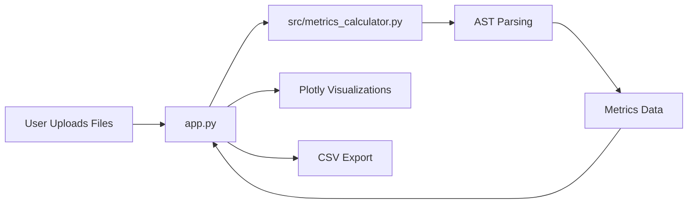

# System Architecture

The Software Metrics Calculator is built with a modular architecture that separates data processing from the presentation layer.

## Core Components

*   **Presentation Layer (`app.py`)**: Built with Streamlit, this module manages the interactive dashboard, user file uploads, and state management for visualizations.
*   **Analysis Engine (`src/metrics_calculator.py`)**: The functional heart of the project. It handles static code analysis, agile data aggregation, and estimation modeling.
*   **Schema Layer**: Utilizes Python `dataclasses` to ensure type safety and consistent data structures across the application.

## Metrics Calculation Process

### 1. Code Analysis
The tool uses the built-in `ast` (Abstract Syntax Trees) module to parse Python source code.
- **Cyclomatic Complexity**: Calculated by counting decision points (If, While, For, Assert, etc.) in the AST.
- **Cognitive Complexity**: Calculated using a custom recursive visitor that accounts for nesting levels.
- **Function Points**: Estimated based on the number of functions and classes.

### 2. Project Estimation (COCOMO)
Uses the Basic COCOMO model:
- `Effort = 2.4 * (kLOC ^ 1.05)`
- `Time = 2.5 * (Effort ^ 0.38)`

### 3. Agile Analysis
Parses JSON sprint data to calculate:
- **Velocity**: Mean of completed story points across sprints.
- **Scope Creep**: Ratio of added points to planned points.

## Data Flow

